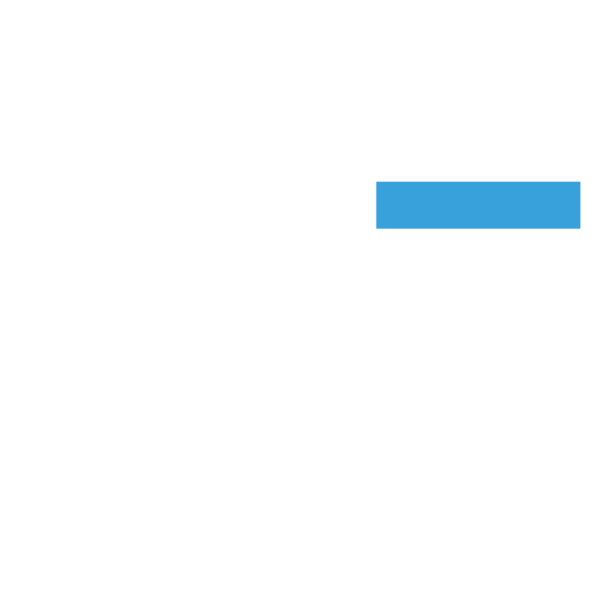

<p align="center">
  
</p>

<h1 align="center">lucasdecastro.dev</h1>

<p align="center">
  My personal portfolio website built with modern web technologies
</p>

<p align="center">
  <a href="https://lucasdecastro.dev">Visit Website</a>
</p>

## 🛠️ Built With

- [Next.js 14](https://nextjs.org/) - React framework with App Router
- [TailwindCSS](https://tailwindcss.com/) - For styling
- [next-intl](https://next-intl-docs.vercel.app/) - For internationalization
- [TypeScript](https://www.typescriptlang.org/) - For type safety

## ✨ Features

- 🌐 Internationalization (English and Portuguese)
- 🎨 Modern and minimalist design
- 📱 Fully responsive
- 🚀 Optimized performance
- 🌙 Dark mode by default

## 🚀 Getting Started

1. Clone the repository:

```bash
git clone https://github.com/lcastrof/lucasdecastro.dev.git
```

2. Install dependencies:

```bash
npm install
```

3. Run the development server:

```bash
npm run dev
```

4. Open [http://localhost:3000](http://localhost:3000) in your browser.

## 🔜 Future Improvements

- [ ] Add blog section
- [ ] Add RSS feed
- [ ] Add search functionality
- [ ] Add projects showcase
- [ ] Add contact form

## 🤝 Contributing

Contributions, issues and feature requests are welcome!

## 📫 Contact

- Website: [lucasdecastro.dev](https://lucasdecastro.dev)
- GitHub: [@lcastrof](https://github.com/lcastrof)
- LinkedIn: [Lucas de Castro](https://linkedin.com/in/lucas-fernandino)
- Email: [lucascastrofr@gmail.com](mailto:lucascastrofr@gmail.com)
